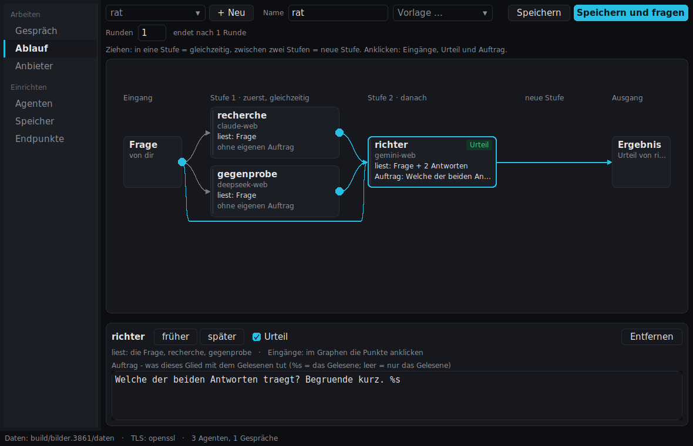
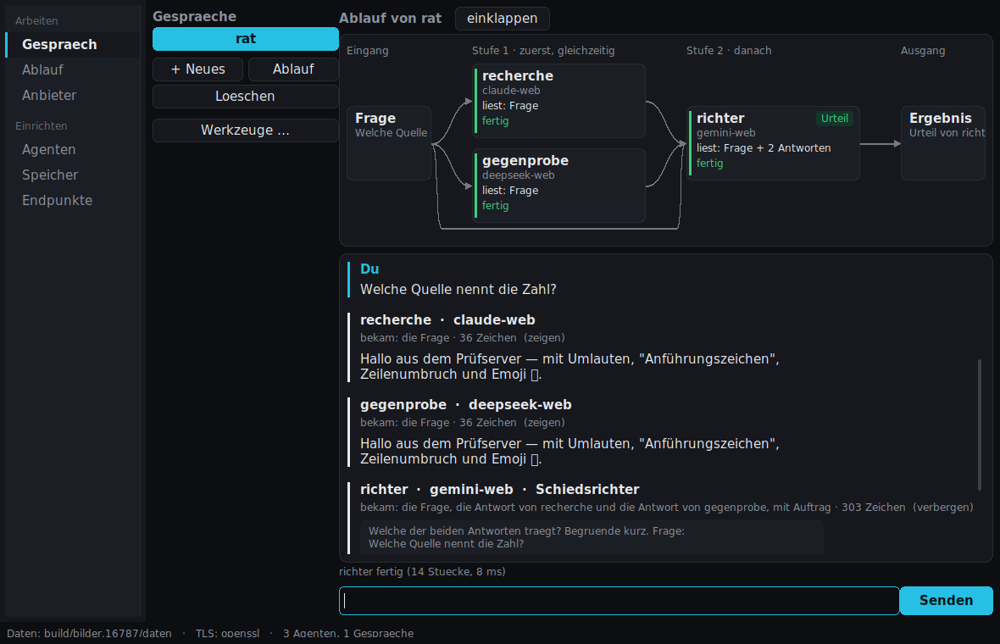

# C99 AI-Hypervisor – Anleitung

Ein Programm, das mit mehreren KI-Diensten zugleich arbeitet und sie zu einem
**Ablauf** verbindet: Wer antwortet zuerst, wer gleichzeitig, wer liest wessen
Antwort, wessen Urteil zählt am Ende. Die Dienste werden entweder über ihre
**Weboberfläche mit deiner angemeldeten Browsersitzung** angesprochen
(claude.ai, chat.deepseek.com, gemini.google.com, chatgpt.com, grok.com – ohne
API-Schlüssel, ohne Zusatzkosten) oder über eine **API mit Schlüssel**
(Anthropic, OpenAI, DeepSeek, OpenRouter, lokales Ollama).



Inhalt: [Start](#1-start) · [Begriffe](#2-die-begriffe) ·
[Zugang einrichten](#3-zugang-einrichten) · [Agenten](#4-agenten) ·
[Ablauf](#5-der-ablauf) · [Gespräch](#6-das-gespräch) ·
[Anbieter](#7-anbieter-die-gespräche-beim-dienst) · [Speicher](#8-speicher-gedächtnis) ·
[Kommandozeile](#9-kommandozeile) · [Wenn etwas nicht geht](#10-wenn-etwas-nicht-geht) ·
[Grenzen](#11-was-das-programm-nicht-kann) · [Lizenz](#12-lizenz)

---

## 1. Start

| Ordner | Programme |
|---|---|
| `windows/` | `gpb-gui.exe` (Fenster), `gpb-browser.exe` (Kommandozeile). Keine Installation, keine DLLs, kein OpenSSL – TLS läuft über Windows selbst. |
| `linux-x86_64/` | `gpb-gui`, `gpb-browser`. Braucht X11 mit Xft und OpenSSL 3; auf einem üblichen Desktop vorhanden. |

Das Fenster starten (`gpb-gui`), fertig. Ein einzelnes Programm ohne
Installer: Es lässt sich von jedem Ort starten, auch vom USB-Stick.

**Wo deine Daten liegen.** Alles, was du einrichtest, liegt im
Anwendungsordner deines Systems, nicht neben dem Programm:

| System | Ordner |
|---|---|
| Windows | `%APPDATA%\gpb-browser` (also `C:\Users\<du>\AppData\Roaming\gpb-browser`) |
| Linux/BSD | `~/.local/share/gpb-browser` (oder `$XDG_DATA_HOME/gpb-browser`) |
| macOS | `~/Library/Application Support/gpb-browser` |

```
gpb-browser/
  keks/       Zugänge zu den Weboberflächen (deine Sitzungs-Cookies)
  agenten/    Agenten (JSON, eine Datei je Agent)
  chats/      Abläufe
  speicher/   Gedächtnis-Sammlungen
  faden/      gemerkte Gespräche beim Anbieter
  verlauf/    Gesprächsverläufe
```

Die Fußzeile des Fensters zeigt den Pfad. Ein anderer Ort:
`--daten=<verzeichnis>` oder die Umgebungsvariable `GPB_DATEN`. **`keks/`
enthält deine Anmeldung bei den Diensten – wer diesen Ordner hat, ist bei den
Diensten du.** Nicht weitergeben, nicht in eine Cloud-Synchronisation legen.

Beim ersten Start zeigt die Ansicht *Gespräch* die drei nötigen Schritte mit
einem Knopf zu jedem: Zugang einrichten → Agent anlegen → Ablauf bauen.

## 2. Die Begriffe

| Begriff | Bedeutung |
|---|---|
| **Endpunkt** | Ein Dienst, so wie das Programm ihn erreicht: `claude-web` ist claude.ai über deine Browsersitzung, `claude` ist die Anthropic-API mit Schlüssel. Endpunkte sind fest eingebaut; du richtest nur den Zugang ein. |
| **Agent** | Ein Endpunkt plus eine **Rolle** (der Master-Prompt: „Du prüfst kritisch und nennst Quellen"), wahlweise ein Modell, ein Gedächtnis und die Einstellung, ob er beim Anbieter im selben Gespräch weiterschreibt. |
| **Ablauf** | Mehrere Agenten und ihre Verdrahtung: in welcher **Stufe** jeder läuft, was er **liest**, was sein **Auftrag** ist, wer das **Urteil** spricht, wie viele **Runden**. Ein gespeicherter Ablauf ist das, was du fragst. |
| **Gespräch** | Ein Ablauf in Betrieb: deine Frage, die Antworten, der Bericht. |
| **Speicher** | Ein Gedächtnis: Textstücke, die einem Agenten vor jeder Frage passend dazugegeben werden. |
| **Anbieter** | Die Ansicht, in der du die Gespräche eines Dienstes siehst, wie sie auf dessen Webseite stehen. |

## 3. Zugang einrichten

### Wie die Anmeldung über den Browser funktioniert

Wenn du dich im Browser bei claude.ai anmeldest, legt die Seite in deinem
Browser **Cookies** ab. Das wichtigste davon ist das **Anmelde-Cookie** – ein
langer, zufälliger Wert, der bei jeder Anfrage mitgeschickt wird und der Seite
sagt: „Das ist der angemeldete Nutzer X." Der Browser schickt außerdem bei
jeder Anfrage seine **Kennung** mit, den User-Agent („Chrome 130 auf
Windows"), und einige Begleitzeilen dazu (`sec-ch-ua`, `Accept-Language` …).

Das Programm macht genau dasselbe wie der Browser: Es schickt an dieselben
Adressen dieselben Cookies und dieselbe Kennung. Der Dienst kann das nicht
vom Browser unterscheiden – **das ist der ganze Trick**, und deshalb braucht
es keinen API-Schlüssel. Es braucht aber zwei Dinge aus deinem Browser:

1. **Die Cookies des Dienstes.** Je Dienst ein bestimmtes Anmelde-Cookie,
   dazu bei manchen ein Cloudflare-Cookie:

   | Endpunkt | Adresse | Anmelde-Cookie | Zusätzlich |
   |---|---|---|---|
   | `claude-web` | claude.ai | `sessionKey` | `cf_clearance` (Cloudflare) |
   | `deepseek-web` | chat.deepseek.com | `userToken` oder `ds_session_id` | Kopfzeile `authorization: Bearer …` – **kommt in keinem Cookie-Export mit**, siehe unten |
   | `gemini-web` | gemini.google.com | `__Secure-1PSID` | `__Secure-1PSIDTS` – wird von Google laufend erneuert, ein alter Export gilt nach Stunden nicht mehr |
   | `chatgpt-web` | chatgpt.com | `__Secure-next-auth.session-token` | `cf_clearance` |
   | `grok-web` | grok.com | `sso` (und `sso-rw`) | `cf_clearance` – die Cookies von **grok.com**, nicht die von x.com, auch wenn die Anmeldung über X lief |

2. **Die Kennung deines Browsers (User-Agent).** Cloudflare bindet
   `cf_clearance` an die Kombination aus IP-Adresse, User-Agent und
   TLS-Fingerabdruck. Dieselben Cookies mit einem anderen User-Agent werden
   abgelehnt (HTTP 403). Deshalb muss die Kennung *deines* Browsers mit.

Diese beiden Dinge landen in einer **Zugangsdatei** je Dienst,
`daten/keks/<endpunkt>.txt`. Das Programm zeigt Cookie-Werte nirgends an,
schreibt sie in kein Protokoll und in keine Meldung; die Prüfung nennt nur
Namen und Ablaufdaten.

### Weg A: alle Dienste auf einmal aus einer Cookie-Datei

Der schnellste Weg, wenn du mehrere Dienste nutzen willst.

1. Im Browser bei allen Diensten anmelden, die du nutzen willst.
2. Eine Erweiterung installieren, die Cookies im **Netscape-Format**
   exportiert – z. B. „Get cookies.txt LOCALLY" (Chrome, Firefox). **Alle**
   Cookies exportieren, nicht nur eine Domain: Die Datei trägt dann jede
   Domain, und jeder Dienst bekommt daraus genau seine eigenen Zeilen. Die
   Cookies anderer Seiten in der Datei werden ignoriert.
3. Die Kennung deines Browsers holen: **F12** → Reiter **Konsole** →
   `navigator.userAgent` eingeben → den Text ohne Anführungszeichen kopieren.
4. Im Fenster, Ansicht **Endpunkte**, Karte **Alle auf einmal einrichten**:
   - den Pfad der exportierten Datei in das Feld eintragen und **Aus Datei**
     drücken – oder den Dateiinhalt in die Zwischenablage kopieren und
     **Aus Zwischenablage** drücken;
   - vorher den User-Agent in das Feld **User-Agent** eintragen. Er wird in
     jede Zugangsdatei geschrieben, die dabei entsteht.
5. Die Liste darunter zeigt je Dienst, was er bekommen hat und was fehlt.

Auf der Kommandozeile:

```
gpb-browser web einrichten --aus=cookies.txt --user-agent="Mozilla/5.0 (…) Chrome/130.0.0.0 …"
gpb-browser web pruefen
```

Der User-Agent lässt sich auch nachträglich für alle Dienste zugleich setzen,
aus einer beliebigen „Als cURL kopieren"-Zeile desselben Browsers (Weg B,
Schritt 4): `gpb-browser web kopf --aus=anfrage.txt`. Dabei werden **nur**
die Kennungszeilen übernommen, die Cookies bleiben unberührt.

**DeepSeek geht über Weg A nicht vollständig.** chat.deepseek.com hält seinen
Zugangstoken nicht in einem Cookie, sondern im localStorage des Browsers und
schickt ihn als Kopfzeile `authorization: Bearer …`. Eine Cookie-Datei kann
diese Zeile nicht enthalten. Für DeepSeek deshalb zusätzlich Weg B – und dort
ausdrücklich eine Anfrage unter `/api/`, denn nur die trägt die Zeile.

### Weg B: ein Dienst aus einer kopierten Anfrage

Der genaue Weg; er bringt alles mit, was der Browser wirklich schickt –
Cookies, User-Agent und die Begleitzeilen.

1. Im Browser beim Dienst anmelden.
2. **F12** → Reiter **Netzwerk** (Network). Ist die Liste leer, die Seite
   neu laden oder eine Frage stellen.
3. Eine Anfrage **an den Dienst selbst** auswählen (Spalte „Domain" =
   claude.ai, chatgpt.com …). Bei DeepSeek eine, deren Adresse mit `/api/`
   beginnt, z. B. `/api/v0/users/current`.
4. Rechte Maustaste → **Kopieren** → **Als cURL kopieren** (Chrome/Edge unter
   Windows: die Variante „cmd"; beide Formen werden gelesen).
5. Im Fenster, Ansicht **Endpunkte**, in der Zeile des Dienstes
   **Aus Zwischenablage einrichten** drücken. Fertig; die Zeile zeigt den
   Zustand.

Auf der Kommandozeile den kopierten Text in eine Datei speichern:

```
gpb-browser web einrichten deepseek-web --aus=anfrage.txt
```

Ohne `--aus` wartet der Befehl auf den eingefügten Text im Terminal
(Einfügen, dann eine leere Zeile). Es geht auch mit den rohen Kopfzeilen
oder mit der Ausgabe von `document.cookie` – nur bringt das den User-Agent
nicht mit, „Als cURL kopieren" schon.

### Prüfen, ob es stimmt

Im Fenster steht in jeder Endpunkt-Zeile ein Punkt mit dem Zustand:
grün = eingerichtet (mit Cookie-Zahl und Ablauf), rot = etwas fehlt oder
ist abgelaufen, grau = nicht eingerichtet. Genauer sagt es die
Kommandozeile, **ohne eine einzige Anfrage zu senden**:

```
$ gpb-browser web pruefen claude-web

claude-web  (Claude (claude.ai, Browsersitzung))
  Adresse        https://claude.ai
  Zugang         …/daten/keks/claude-web.txt
  Cookies        7 gelesen: sessionKey cf_clearance __cf_bm …
  Anmeldung      ✓ sessionKey
  cf_clearance   ✓ da (gilt nur fuer dieselbe IP und denselben User-Agent)
  User-Agent     ✓ derselbe wie im Browser
  Laeuft ab      in 13 Tage (fruehestes Cookie)
  → vollstaendig. Ob es DURCHKOMMT, entscheidet der TLS-Fingerabdruck.
```

`gpb-browser web pruefen` ohne Namen prüft alle fünf. Was fehlt, steht als
Satz da – etwa „das Anmelde-Cookie sessionKey fehlt" oder bei DeepSeek
„authorization fehlt".

### Die Zugangsdatei selbst

`daten/keks/<endpunkt>.txt` ist eine Textdatei. Zwei Formen werden gelesen:
Netscape-Zeilen (`.claude.ai TRUE / TRUE 1790000000 sessionKey sk-…`) oder eine
rohe Cookie-Zeile (`Cookie: sessionKey=…; cf_clearance=…`), dazu je eine Zeile
`User-Agent: …` und weitere Kopfzeilen (`sec-ch-ua: …`,
`authorization: Bearer …`). Man kann sie von Hand anlegen; die Umgebungsvariable
`GPB_<DIENST>_COOKIES` (z. B. `GPB_CLAUDE_COOKIES=/pfad/datei.txt`) hat Vorrang
vor der Datei im Datenordner.

**Sitzungen laufen ab.** Ein Anmelde-Cookie gilt Tage bis Wochen,
`cf_clearance` meist kürzer, Googles `__Secure-1PSIDTS` Stunden. Meldet ein
Dienst „Sitzung gilt nicht (mehr)" oder liefert er die Anmeldeseite, ist das
der Grund: im Browser die Seite neu laden (dabei erneuert der Browser die
Cookies) und den Zugang neu einrichten. Das Fenster erkennt den Fall und
sagt es; der Knopf **Entfernen** in der Endpunkt-Zeile löscht einen Zugang.

### Stattdessen ein API-Schlüssel

Wer einen Schlüssel hat, setzt ihn als Umgebungsvariable; eine Datei dafür
gibt es absichtlich nicht.

| Endpunkt | Variable | eigene Adresse (optional) |
|---|---|---|
| `claude` | `ANTHROPIC_API_KEY` | `GPB_CLAUDE` |
| `gpt` | `OPENAI_API_KEY` | `GPB_GPT` |
| `deepseek` | `DEEPSEEK_API_KEY` | `GPB_DEEPSEEK` |
| `openrouter` | `OPENROUTER_API_KEY` | `GPB_OPENROUTER` |
| `ollama` | – | `GPB_OLLAMA` (Standard 127.0.0.1:11434) |
| `lokal` | `GPB_LOKAL_KEY` | `GPB_LOKAL` (jeder OpenAI-kompatible Server) |

Unter Windows: Systemsteuerung → System → Umgebungsvariablen, oder in der
Eingabeaufforderung `set ANTHROPIC_API_KEY=sk-…` vor dem Start. Die Ansicht
*Endpunkte* zeigt je Schlüssel-Endpunkt, ob die Variable gesetzt ist.

## 4. Agenten

Ansicht **Agenten** → **+ Neuer Agent**.

- **Name** – nur Buchstaben, Ziffern, `-` und `_`; er wird zum Dateinamen.
- **Endpunkt** – der Dienst. Die Liste zeigt, ob sein Zugang steht.
- **Modell** – bei APIs eine Liste der Modelle, bei Weboberflächen meist
  „wählt der Dienst selbst" (das Modell ist dort im Browser eingestellt).
  Bei `deepseek-web` schaltet `deepseek-reasoner` den DeepThink-Modus ein.
- **Master-Prompt** – die Rolle. Steht vor *jeder* Frage dieses Agenten, in
  jedem Ablauf. Was er nur in *einem* Ablauf tun soll, gehört nicht hierher,
  sondern in seinen **Auftrag** im Ablauf.
- **Speicher / Recht / geteilt** – siehe [Speicher](#8-speicher-gedächtnis).
- **Gespräch beim Anbieter fortsetzen** – nur Weboberflächen. Standardmäßig
  legt jeder Lauf beim Dienst ein neues Gespräch an. Mit diesem Haken merkt
  sich der Agent das Gespräch (unter `daten/faden/`) und schreibt beim
  nächsten Mal darin weiter: Der Dienst kennt dann den bisherigen Verlauf,
  und dein Konto füllt sich nicht mit leeren Gesprächen.

## 5. Der Ablauf

Ansicht **Ablauf**. Oben wählst du einen gespeicherten Ablauf oder legst mit
**+ Neu** einen an; der Graph darunter ist der Ablauf selbst.

```
 Frage ──► Stufe 1 ──► Stufe 2 ──► … ──► Ergebnis
           (alle darin gleichzeitig)          │
   ▲──────────── weitere Runde ───────────────┘
```

**Jeder Pfeil ist ein echter Datenweg.** Was ein Agent liest, bekommt er
wörtlich und vollständig, mit Namensschild („recherche sagt: …"). Am Knoten
steht es ausgeschrieben: „liest: Frage + recherche + gegenprobe".

**Stufen.** Wer in derselben Spalte steht, läuft **gleichzeitig**; die
Spalten laufen nacheinander. Gewartet wird nur zwischen zwei Stufen.

**Agenten dazunehmen.** **+ gleichzeitig** unter einer Stufe stellt einen
Agenten in diese Stufe (er liest dasselbe wie seine Nachbarn); **+ Agent**
unter „neue Stufe" hängt eine Stufe hinten an (er liest die Frage und alles
davor).

**Ziehen.** Einen Knoten in eine andere Spalte ziehen: Er läuft dort
gleichzeitig mit. Zwischen zwei Spalten oder auf „neue Stufe" ablegen: Dort
entsteht eine neue Stufe, und der Agent liest die Frage und alle Antworten
davor. Wege, die danach unmöglich wären (jemand hört einen, der erst später
antwortet), fallen weg – die Meldung unten sagt, welche.

**Anklicken** wählt einen Agenten. Dann:

- An der Frage und an allen Agenten *früherer* Stufen erscheinen
  **Anschlusspunkte**. Ein Klick schaltet um, ob der gewählte Agent das
  liest. Ein leuchtender Punkt = er liest es.
- Unten: **früher / später** (verschiebt um eine Stufe), **Urteil**,
  **Entfernen** und der **Auftrag**.

**Auftrag.** Was *dieses* Glied mit dem Gelesenen tun soll, z. B.
„Prüfe beide Antworten auf Widersprüche und nenne die tragfähigere: %s".
`%s` ist die Stelle, an der das Gelesene eingesetzt wird; ohne `%s` kommt es
dahinter. Leer = der Agent bekommt das Gelesene ohne Zusatz.

**Hausordnung.** Ist kein Agent gewählt, steht unten ein Text, der für alle
Agenten dieses Ablaufs gilt – nach ihrer eigenen Rolle. Etwa: „Antworte auf
Deutsch, höchstens 200 Wörter."

**Urteil (Schiedsrichter).** Genau ein Agent kann das Urteil tragen: Seine
Antwort ist das Ergebnis des Laufs, und die Abbruchbedingung liest sie. Ohne
Urteil gelten alle Antworten der letzten Stufe als Ergebnis.

**Vorlage** setzt die ganze Verdrahtung auf einmal:

| Vorlage | Bedeutung |
|---|---|
| alle gleichzeitig | alle in Stufe 1, jeder liest nur die Frage |
| nacheinander, jeder liest alles davor | Agent 1, 2, 3 … in eigenen Stufen; jeder bekommt die Frage und alle bisherigen Antworten |
| Kette, jeder nur den Vorgänger | jeder bekommt nur die Antwort des direkten Vorgängers, der erste die Frage. Bei genau einer Quelle geht die Übergabe byte-genau über einen `.gpb`-Container mit gemessenem Rundlauf-Beleg. |

Danach lässt sich jeder Eingang einzeln wieder ändern.

**Runden und Ende.** Bei mehr als einer Runde wird dieselbe Frage erneut
gestellt; jeder Agent behält seinen eigenen Verlauf und sieht die neuen
Antworten der anderen. Schluss ist

- nach allen Runden, oder
- **auf ein Wort**: sobald das Urteil (oder ohne Urteil: eine Antwort der
  letzten Stufe) das Wort enthält, z. B. `FERTIG` – Groß-/Kleinschreibung
  egal, oder
- **wenn Ruhe einkehrt**: sobald sich das Urteil gegenüber der Vorrunde
  nicht mehr ändert.

Die Rundenzahl bleibt in jedem Fall die Obergrenze; das begrenzt, was ein
Lauf bei einem bezahlten Dienst kosten kann.

**Speichern und fragen** prüft den Ablauf, speichert ihn und öffnet das
Gespräch. Ein Ablauf, der nicht laufen kann, wird vorher abgelehnt und der
Grund genannt.

*Beispiel* (das Bild oben): `recherche` (claude.ai) und `gegenprobe`
(DeepSeek) beantworten die Frage gleichzeitig; `richter` (Gemini) liest die
Frage und beide Antworten, hat den Auftrag „Welche der beiden Antworten
trägt? Begründe kurz. %s" und das Urteil. Das Ergebnis ist die Antwort des
Richters.

## 6. Das Gespräch



Links die gespeicherten Abläufe, rechts das Gespräch. Frage unten eintippen
oder einfügen – das Feld ist mehrzeilig und ohne Längengrenze. **Enter**
sendet, **Shift+Enter** macht eine neue Zeile.

**Der Ablauf live.** Über dem Verlauf steht derselbe Graph in Betrieb: Die
aktive Stufe leuchtet, jeder Agent zeigt *wartet / schreibt … 240 Token /
fertig / Fehler*, der Weg, auf dem gerade Daten fließen, ist hervorgehoben,
bei mehreren Runden steht „Runde 2 von höchstens 5". **einklappen** lässt
nur eine Zeile stehen.

**Was jeder Agent bekam.** Unter jeder Antwort steht z. B. „bekam: die
Frage, die Antwort von recherche und die Antwort von gegenprobe, mit Auftrag ·
303 Zeichen". Ein Klick auf **(zeigen)** öffnet den Text, der wirklich an den
Dienst ging – so, wie der Dienst ihn gesehen hat, mit Auftrag und
Namensschildern. Damit ist jederzeit nachprüfbar, was ein Agent wusste.

**Farben.** Blau = du, weiß = Antworten, grau = Hinweise und der Bericht nach
dem Lauf (Stufen, Urteil, Grund des Endes, Token, Dauer), **rot = Fehler**.

**Herausholen.** **Kopieren** neben jeder Antwort legt ihren Text in die
Zwischenablage; **Verlauf kopieren** (über dem Eingabefeld) das ganze
Gespräch als Text mit Sprechernamen. Als Datei sichert es **Werkzeuge …**
(unten).

**Abbrechen.** Während eine Antwort läuft, wird **Senden** zu
**Abbrechen**. Die Teilantwort bleibt sichtbar, geht aber nicht in den
Verlauf – ein Modell soll beim nächsten Zug kein halbes eigenes Wort
vorgelegt bekommen.

Der Knopf **Ablauf** (links) führt in die Ansicht Ablauf; nach dem
Speichern gilt der neue Aufbau ab der nächsten Frage, der Verlauf bleibt
stehen. **Löschen** entfernt den gespeicherten Ablauf – nach einem zweiten
Klick zur Bestätigung.

**Werkzeuge …** (links):

- **Antwort als .gpb** – die letzte Antwort in einen `.gpb`-Container
  schreiben (mit Rundlauf-Beleg: kodieren, zurücklesen, byte-genau
  vergleichen) oder einen Container in den Verlauf laden.
- **Verlauf laden / sichern** – der Verlauf jedes Agenten als
  `.jsonl`-Datei; damit lässt sich ein Gespräch später fortsetzen.
- **Kontextfenster** – ältere Züge automatisch wegfallen lassen, in Bytes
  oder Token (Token erst, wenn der Dienst eine Tokenzahl gemeldet hat).
  Standard: aus. Jeder Wegfall wird im Verlauf gemeldet.
- **Vergleichen** – bei mehreren Antworten ein Vergleichsbericht über die
  Invarianten der Texte (Substanz, Token, Struktur), keine Bewertung des
  Inhalts.
- **Übergabe-Hygiene** – nur bei Ketten: prüft den weitergereichten Text auf
  unsichtbare Steuerzeichen, Bidi-Overrides und Chat-Rollenmarken wie
  `<|im_start|>`; *streng* entfernt sie. Kein Schutz gegen Anweisungen im
  Text, nur gegen Zeichen, die dem Leser etwas anderes zeigen als dem
  Modell.

## 7. Anbieter: die Gespräche beim Dienst

Ansicht **Anbieter**: einen Dienst wählen, **Neu laden** holt seine
Gesprächsliste, so wie sie auf der Webseite steht. Ein Gespräch anklicken
zeigt es Zug für Zug; unten weiterschreiben (Enter sendet, Shift+Enter neue
Zeile), **+ Neues** beginnt eins. Das
Suchfeld filtert die Liste nach Namen. Öffnet die Ansicht einen Chat, der
über diesen Dienst schreibt, ist dessen Gespräch in der Liste markiert.

| Dienst | Was geht |
|---|---|
| claude.ai, chat.deepseek.com, gemini.google.com | Liste, öffnen, lesen, weiterschreiben, neu beginnen |
| chatgpt.com, grok.com | Liste, öffnen, lesen. **Senden nicht**: Beide Seiten verlangen vor jeder Anfrage einen Wert, den nur ihr eigenes JavaScript im Browser berechnet (ChatGPT einen Proof-of-Work in WASM, Grok eine je Sitzung erzeugte Kennung). Ohne echten Browser ist er nicht herstellbar; das Programm meldet den Fall beim Namen statt zu raten. |

Gespräche, die du hier öffnest, gehören dir und werden vom Programm nie
gelöscht. Aufgeräumt wird nur, was das Programm selbst angelegt hat.

## 8. Speicher (Gedächtnis)

Ein Speicher ist eine Sammlung von Textstücken (Notizen, Belege, Protokolle,
Fehlermeldungen). Ein Agent, der ihn nennt, bekommt vor jeder Frage die
Stücke vorangestellt, die am meisten mit der Frage gemeinsam haben; mit
Recht **schreiben** legt er seine Antworten selbst darin ab. **Geteilt**
heißt: Alle Agenten, die diesen Namen nennen, sehen dieselbe Datei; sonst
hat jeder Agent seine eigene.

Ansicht **Speicher**: Sammlung anlegen (**Neu**), ein Stück in den Kasten
oben schreiben und **Übernehmen**, **Suchen** (die Trefferliste zeigt, warum
ein Stück gefunden wurde), einzelne Stücke anklicken und ändern oder
entfernen, **Säubern** (Leeres und buchstabengleich Doppeltes weg), **Backen**
(alles neu rechnen). Ganze Dateien legt die Kommandozeile ab:
`gpb-browser speicher legen wissen @protokoll.md --quelle=protokoll`.

**Was die Suche kann und was nicht.** Verglichen werden Wörter (über ihre
Buchstaben-Substanz, also unabhängig von Groß-/Kleinschreibung und Akzenten)
und ein berechneter Merkmalsvektor des Textes – kein gelerntes Modell, nichts
muss heruntergeladen werden, und dieselbe Eingabe ergibt auf jedem Rechner
dasselbe. Gefunden wird, was mit der Frage **Wörter teilt**; „Auto" findet
„Fahrzeug" nicht. Das reicht für alles, wo die Frage die Wörter der Antwort
enthält. Zu große Stücke werden beim Ablegen geteilt, weil jedes Stück
komplett in den Kontext des Modells wandert.

## 9. Kommandozeile

`gpb-browser` kann alles, was das Fenster kann, und eignet sich für Skripte
und Rohrleitungen: **stdout trägt nur Antworttext**, alles andere geht nach
stderr.

```
gpb-browser --modell=claude-web "Frage"                 eine Frage
gpb-browser --dialog --modell=claude-web                Gespräch im Terminal (:hilfe)
gpb-browser --chat=rat "Frage"                          einen gespeicherten Ablauf fragen
gpb-browser --modell=claude --modell=gpt --konsens "F"  dieselbe Frage an zwei, mit Vergleich
gpb-browser "--kette=claude>deepseek" --beleg "Frage"   Kette mit Rundlauf-Beleg
gpb-browser --modell=claude --fallback=gpt "Frage"      Ausweichen bei 429/5xx
gpb-browser --modell=ollama "Frage" | gpb-browser --modell=gpt

gpb-browser web liste | einrichten | pruefen | kopf | holen | entfernen
gpb-browser agent liste | zeigen | neu | aendern | loeschen
gpb-browser chat liste | zeigen | neu | aendern | loeschen
gpb-browser speicher liste | zeigen | legen | suchen | weg | aendern | backen | saeubern
gpb-browser --hilfe          gpb-browser agent hilfe   (ebenso chat, speicher, web)
```

`web holen <dienst> <pfad>` ruft eine beliebige Adresse des Dienstes mit
deiner Sitzung ab (`web holen claude-web /api/organizations`) – nützlich, um
zu sehen, was eine Seite wirklich antwortet.

## 10. Wenn etwas nicht geht

| Meldung / Verhalten | Ursache | Was tun |
|---|---|---|
| „nicht eingerichtet" | kein Zugang für diesen Dienst | Abschnitt 3 |
| „das Anmelde-Cookie … fehlt" | Export ohne diese Domain, oder im Browser nicht angemeldet | anmelden, neu exportieren |
| „keine User-Agent-Zeile" | Cookie-Datei ohne Browserkennung | User-Agent eintragen (Weg A, Schritt 3) oder `web kopf` |
| „HTTP 401 — die Sitzung gilt nicht (mehr)" / Anmeldeseite statt Antwort | Cookies abgelaufen oder im Browser abgemeldet | im Browser neu laden, Zugang neu einrichten |
| „HTTP 403 mit einer HTML-Seite … Bot-Prüfung" | Cloudflare lehnt ab: `cf_clearance` fehlt, ist abgelaufen oder passt nicht zu User-Agent/IP (anderes Netz, VPN) | frisches cf_clearance über Weg B aus demselben Netz; bleibt es dabei, ist es die TLS-Bindung (Abschnitt 11) |
| DeepSeek: „Missing Token" / „authorization fehlt" | der Token liegt nicht in einem Cookie | Weg B mit einer `/api/`-Anfrage |
| Gemini: Anmeldeseite trotz frischem Export | `__Secure-1PSIDTS` veraltet (wird stündlich erneuert) | Gemini im Browser öffnen, sofort neu exportieren/einrichten |
| ChatGPT/Grok: Lesen geht, Senden nicht | vom Dienst verlangter Browser-Rechenwert | nicht behebbar, siehe Abschnitt 11 |
| Ein Agent im Graphen rot, Verlauf zeigt „Fehler · name" | der Dienst dieses Agenten hat die Antwort abgelehnt; die Stufe läuft mit den anderen zu Ende, der Bericht nennt es | die rote Meldung nennt den Grund (meist Abschnitt 3) |
| Senden-Knopf bleibt „Abbrechen" | ein Dienst antwortet nicht mehr | Abbrechen drücken; Leerlauf-Frist ist 60 s |
| Fenster startet nicht (Linux) | X11/Xft oder OpenSSL fehlt | `libxft2`, `libssl3` installieren; ohne Bildschirm geht die Kommandozeile |

Für die Fehlersuche: `GPB_ROH=<datei>` schreibt die Antwort weg, wenn ein
Vorlaufschritt scheitert; `GPB_ROH_ANFRAGE=<datei>` hängt jede gesendete
Anfrage an eine Datei an. **Diese Datei enthält deine Cookies im Klartext** –
danach löschen.

## 11. Was das Programm nicht kann

- **Senden bei chatgpt.com und grok.com.** Siehe Abschnitt 7.
- **Den TLS-Fingerabdruck eines Browsers nachbilden.** Cookies und
  Kopfzeilen werden gespiegelt; die Reihenfolge der TLS-Erweiterungen setzt
  die TLS-Bibliothek des Systems. Bindet Cloudflare `cf_clearance` daran,
  wird die Sitzung abgelehnt. Bei claude.ai, DeepSeek und Gemini reicht das
  Gespiegelte in der Praxis.
- **Bilder, Dateianhänge, Werkzeugaufrufe.** Nur Text hin, nur Text zurück.
- **Bedeutungssuche im Speicher.** Siehe Abschnitt 8.
- **Kosten schätzen.** Token werden gezählt und im Bericht genannt; Preise
  veralten, deshalb keine Umrechnung.

## 12. Lizenz

CC BY-NC-SA 4.0 mit Sonderklauseln – siehe [LIZENZ.md](LIZENZ.md): frei für
Forschung, Lehre und private Nutzung, Bearbeitungen bleiben offen,
kommerzielle Nutzung nur nach Absprache. Kontakt: silvano19911@gmail.com.
